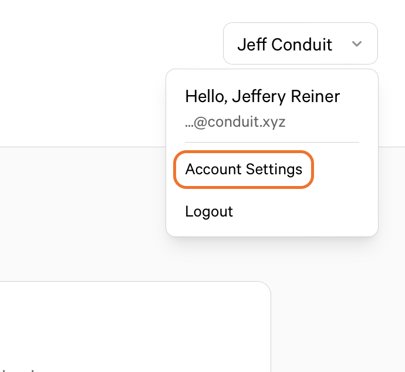
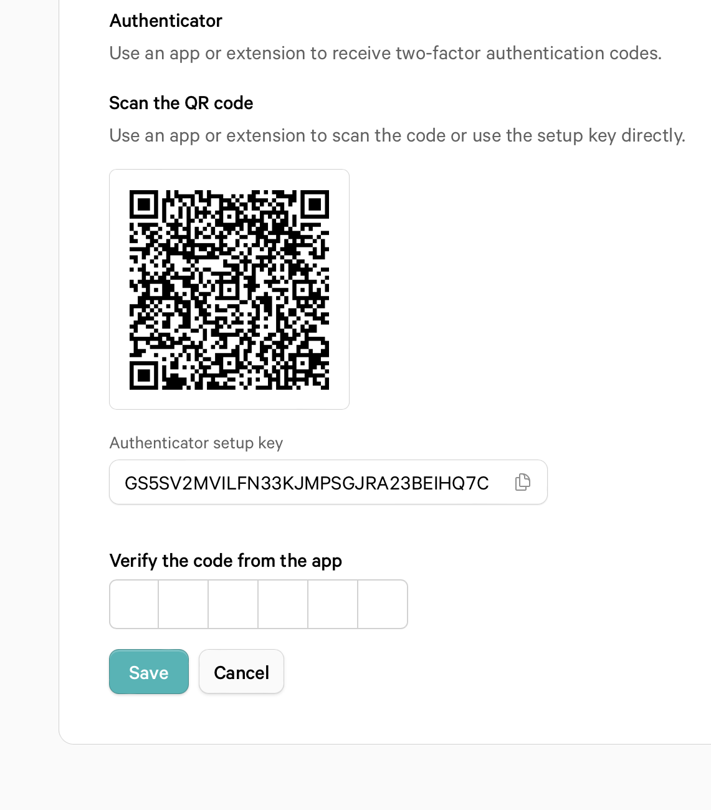

# Configuring Two-factor authentication

Enabling Two-factor authentication (2FA) for your account adds an extra layer of security when logging into your accounts.

> **Note:** If you lose access to your two-factor authentication app, you will need to contact our support to re-gain access to your account.

## Steps

To enroll in Two-factor authentication, a time-based one-time password (TOTP) application generates a code that will change after a certain amount of time. Conduit suggests using two applications during enrollment if the application you wish to use does not support cloud-based backup in case of device loss.

> **Tip**: To setup Two-factor authentication on multiple devices, during setup, scan the QR code using each device or application at the same time. You can also copy the "Authenticator setup key", which is the TOTP secret. If you wish to change your Two-factor authentication device, you must un-enroll your first device before adding a new one.

1. Download a time-based one-time password (TOTP) app to your phone or desktop. Most password managers have this feature built-in.
2. In the upper-right corner of any page, click your name, then click **Account Settings**

   

3. In the "Two-factor authentication" section of the page, click **Add**.
   If you have been logged in for some-time you will need to log back in again to enable Two-factor authentication, we will redirect you back here once you log back in.
4. Under "Scan the QR code", do one of the following:

   - Scan the QR code with your authentication app. Once scanned, the app will show a six-digit code for you to enter.
   - If you're unable to scan the QR code, the "Authenticator setup key" can be used to setup your TOTP account manually.

   

5. Your TOTP application will save your account on conduit.xyz and will generate an authentication code every few seconds. Back in Conduit, type the authentication code into the field under "Verify the code from the app".

### Manually configuring a TOTP app

If you cannot scan the setup QR code or would like to setup your authentication app manually, the required information is:

```txt
Type: TOTP
Label: Conduit:<email> where <email> is the email you sign into Conduit with
Secret: This is the encoded setup key, visible below "Authenticator setup key" during enrollment
Issuer: conduit.xyz
Algorithm: The default of SHA1 is used
Digits: The default of 6 is used
Period: The default of 30 (seconds) is used
```
