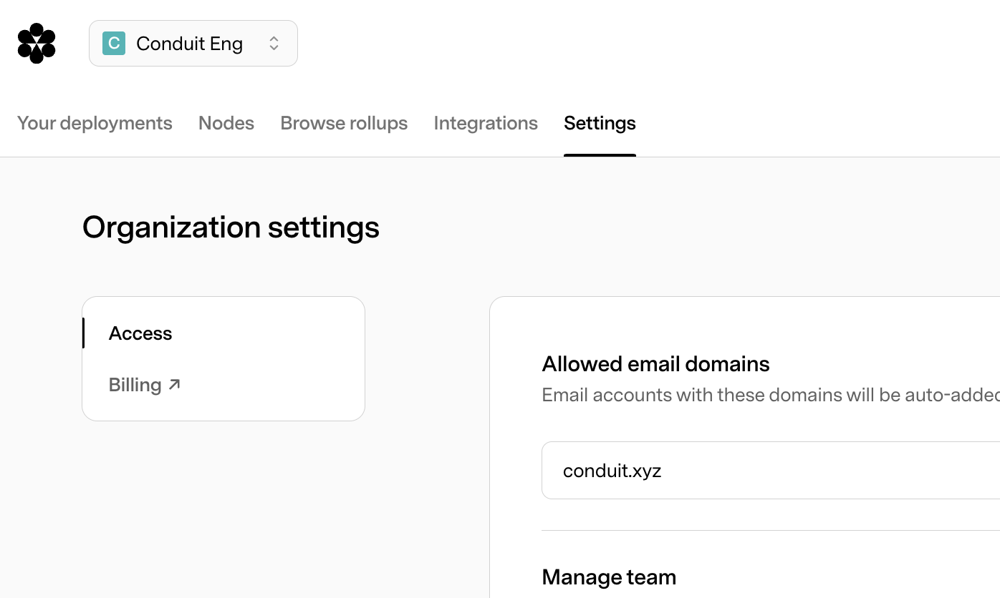

import { Steps } from "nextra/components";

# Finding Previous Invoices and Billing Information

<Steps>

### Go to the [Conduit app](https://app.conduit.xyz)

### Head to the `Settings` tab

### Click on `Billing` in the left-hand menu

You will be redirected to the stripe dashboard where you can view your billing information and previous invoices.

</Steps>
